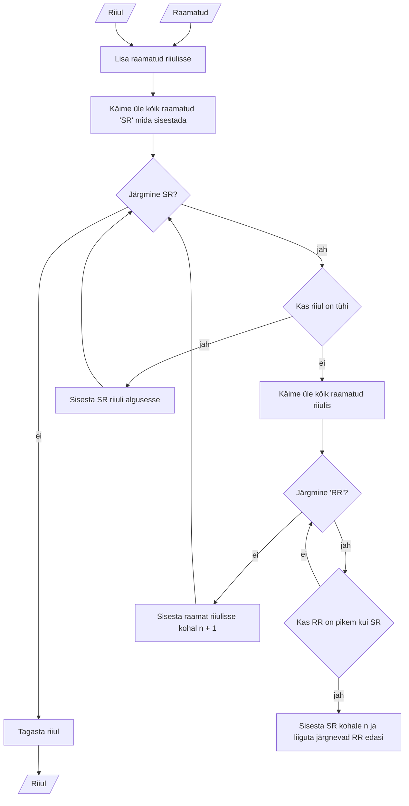

# Raamatute järjestamise algoritm

## Ülesanne

Ülesanne on luua selge ja lühike kirjalik algoritm, mis kirjeldab raamatute riiulil korraldamise samme nende kõrguse põhjal.

### Piirangud:

Eeldage, et saate raamatu kõrgust vaadates kindlaks määrata. Arvestage, et riiulil on fikseeritud pikkus ja see mahutab kõik raamatud.

### Esitamiseks:

Kirjalik algoritm pseudo-koodis või struktureeritud eesti keeles. Joonis algoritmi tööpõhimõttest.

## Lahendus

### Kirjeldus

1. Sisend
   1. Raamatud koos nende kõrgustega
   2. Riiul, kuhu mahuvad kõik raamatud
2. Käime läbi kõik raamatud (SR), mida riulisse lisada, alustades esimesest
   1. Kui riilus ei ole raamatuid, lisame SR kohale 0
   2. Kui riiulis on raamatuid, käime läbi kõik riiulis olevad raamatud (RR)
      1. Kui RR kohal n on kõrgem, kui SR siis nihutame RR kohal n ning järgnevad RR 1 võrra edasi ja sisestame SR kohale n.
      2. Kui viimane RR on väiksem kui SR siis lisame SR kohale RR n+1.
3. Tagastame riiuli

### Joonis

