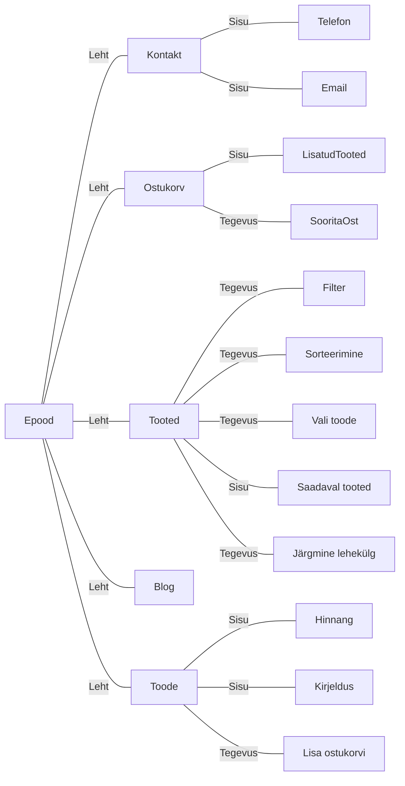

# 5. Puu Joonistamine

### Töövahendid:

Kasuta graafilist tööriista või teeki, millega tunned end mugavalt.
Võib kasutada nt. Microsoft Visiot, Lucidcharti, draw.io-d või muud sarnast. Võib ka kasutada pliiatsit ja paberit.

### Tipud ja servad:

#### Tipud: Esindavad eristatavaid üksusi või positsioone.

- Näide 1 (Ettevõtlus): Tegevjuht, Juht, Meeskonna Juht, Töötaja.
- Näide 2 (Akadeemiline): Ülikool, Kolledž, Osakond, Professor, Õpilane.
- Näide 3 (Meditsiiniline): Haigla Administraator, Osakonna Juhataja, Vanemarst, Õde, Patsient.
- Näide 4 (Digitaalne): Veebisaidi Avaleht, Kategooria Leht, Toote Leht, Ülevaate Leht.

#### Servad: Kirjeldavad sõlmede vahelisi ühendusi või seoseid.

Ettevõtte näites võib töötaja olla alluv meeskonna juhile, liikudes edasi juhataja poole. Akadeemilises kontekstis võib õpilane olla professori alluvuses, kes kuulub kolledži osakonda. Esmatähtis on selgus, märkides selgelt iga sõlme ja selle suhted.

#### Puu suurus:

Proovige koostada puu, mis koosneb 10–15 sõlmest. See suurus pakub sügavuse ja detailide tasakaalu, tagades samal ajal arusaadavuse. Sõltuvalt sinu valitud kontekstist kaalu erinevate alamkategooriate või osakondade eristamist (näiteks erinevad akadeemilised distsipliinid või ettevõtte osakonnad, nagu IT, turundus, finants).

## Lahendus

### Graafiline

> Esitage selge ja struktureeritud puu diagramm, mis toob esile valitud sõlmed ja nende omavahelised suhted.

### Kirjalik

> Kirjuta lühike võrdlus puude ja graafide vahel. Rõhuta puude omadusi (nagu nende atsükliline olemus) ja kuidas need eristuvad üldistest graafidest. Too näiteid olukordadest, kus struktuur on graafina, kuid mitte tingimata puuna.

Puud on hierarhiline struktuur. Hierarhia tõttu on puud ka atsüklilised, kuna hierarhias on "suund" ainult ühele poole - ei saa öelda, et direktor töötab õpetaja all või kool tõõtab õpetaja all. Puu servad ühendavad tippe viisil, et on defineeritud "vanem" tipp ja "laps" tipp. Tehniliselt on võimalik "laps" tipuks määrata mõni "vanem" tipp, kuid siis see ei oleks enam puu, vaid graaf, mis lubab tsüklilisust.

Üks näide puudest on näiteks "Binary Tree", kus igal tippul on 2 alamtippu. Binaar puu kohta võib öelda ka graaf, kuna kõik graafid on mingil määral puud.

Näiteks failisüsteemi võib kohelda ka kui puuna. Kõik failid on mingil määral üksteisega seotud, kuid failid ei ole omavahel seotud. Failid on omavahel seotud ainult läbi kaustade. Failid ei saa olla omavahel seotud, kuna fail ei saa sisaldada faili. Failid on nagu tippud ja kaustad on nagu servad või siis failid on "lehed" ja kaustad on "harud". Kuid failisüsteem pole tingimata puu, kuna failisüsteem võib olla tsükliline. Kaustas olev kaust võib olla viide kaustale, mis asetseb ahelas enne kausta, mis talle viitab. Näiteks kaustas A asetseb kaust B, kus omakorda asetseb kaust C, mis viitab (symlink) kaustale A.

Kaust kasutab kausta-kausta kasutuse kausta.
