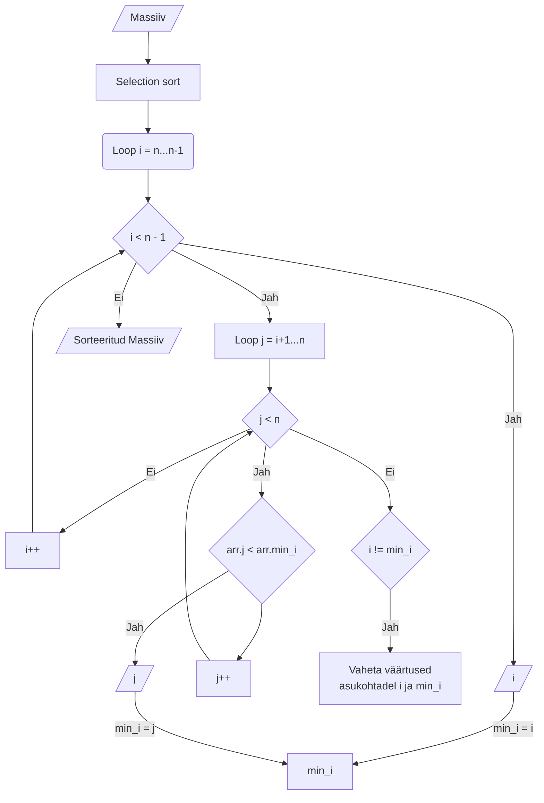

Lahenduse käivitamiseks

```sh
node src/solutions_2/index.js
```

## Ülesanne 1: Bubble Sort simulatsioon

> Antud on järgnevate arvude loend: [64, 34, 25, 12, 22, 11, 90]. Simuleeri samm-sammult Bubble Sort algoritmi. Iga läbimise järel kirjuta üles tulemuseks olev loend.

```
swaps: {
  '1': '34, 64, 25, 12, 22, 11, 90',
  '2': '34, 25, 64, 12, 22, 11, 90',
  '3': '34, 25, 12, 64, 22, 11, 90',
  '4': '34, 25, 12, 22, 64, 11, 90',
  '5': '34, 25, 12, 22, 11, 64, 90',
  '6': '25, 34, 12, 22, 11, 64, 90',
  '7': '25, 12, 34, 22, 11, 64, 90',
  '8': '25, 12, 22, 34, 11, 64, 90',
  '9': '25, 12, 22, 11, 34, 64, 90',
  '10': '12, 25, 22, 11, 34, 64, 90',
  '11': '12, 22, 25, 11, 34, 64, 90',
  '12': '12, 22, 11, 25, 34, 64, 90',
  '13': '12, 11, 22, 25, 34, 64, 90',
  '14': '11, 12, 22, 25, 34, 64, 90'
},
iterations: {
  '1': '34, 25, 12, 22, 11, 64, 90',
  '2': '25, 12, 22, 11, 34, 64, 90',
  '3': '12, 22, 11, 25, 34, 64, 90',
  '4': '12, 11, 22, 25, 34, 64, 90',
  '5': '11, 12, 22, 25, 34, 64, 90',
  '6': '11, 12, 22, 25, 34, 64, 90'
},
```

## Ülesanne 2: Selection Sort visualiseerimine

Alates esimesest iteratsioonist on loendi algus alati sorteeritud, kuna algoritm valib alati veel sorteerimata väärtuste hulgast kõige väiksema ning asetab selle algusesse.

Pole stabiilne, kuna masiivi `3, 3, 1` puhul pärast esimest vahetust on tulemus `1, 3, 3` ning 3-d on kaotanud oma relatiivse järjestuse.



## Ülesanne 3: Insertion Sort praktikas

> Antud on osaliselt sorteeritud loend: [12, 11, 13, 5, 6, 7]. Rakenda Insertion Sort algoritmi. Selgita, miks Insertion Sort võib olla tõhusam sellele loendile võrreldes täielikult sortimata loendiga.

Kui on vaja, et masiiv oleks alati sorteeritud, siis on tõhusam kasutada binary insertionit, et element sisestada juba sorteeritud asendisse. Tegelikult nüüd ei teagi, kas on odavam liigutada elemente tagasi (insertion sort) või luua uus massiiv (binary insertion). Tuleb välja, et elementide liigumatine edasi on odavam, kui uue masiivi loomine, kuna sinna peab nii kui nii kõik elemendid kopeerima.

Insertion sort liigub masiivis lineaarselt 0...n ning võrdleb (bubble sortile sarnaselt) ainult kõrvuti olevaid elemente. Iteratsiooni sees valitakse võrdluseks (ning vahetatakse) hetke ja eelneva koha elemendid, protsessi jätkatakse kuni eelnev element on väiksem. Insertion sorti puhul on vasak pool alati sorteeritud. Kui juhtub, et viimane element on kõige väiksem, siis vahetatakse ta koht ära iga eelnevaga.

> Selgita, miks Insertion Sort võib olla tõhusam sellele loendile võrreldes täielikult sortimata loendiga.

Insertion sort pole kõige effektiivsem antud masiivil `[12, 11, 13, 5, 6, 7]`, kuna väiksemad elemendid asuvad lõpus ning peavad iga eelnevada koha ära vahetama, et jõuda masiivi algusesse. Küll oleks ta effektiivsem masiivi puhul kus väiksemad elemendid asuvad enam vähem ees pool ja suuremad taga pool - näiteks massiivi `[12, 5, 7, 11, 13, 6]` puhul, kuna vältev osa väiksemaid elemente asuvad ees pool ning neid ei pea liigutama 1 sammu haaval lõppust algusesse.

## Ülesanne 4: Ajakompleksuste analüüs

1. Millistel eelmainitud sortimisalgoritmidel on halvimal juhul ajakompleksus O(n^2)?

Kõikidel.

2. Milline sortimisalgoritm oleks kõige sobivam sortimaks loendit täisarvudega, mis jäävad vahemikku 1 kuni 100 ja miks?

Vaadeldes eelmainituid algoritme siis... kui meid ei huvita "stabiilsus" siis kasutaks Selection sorti, kuna ta tundub olevat kiirem. Kui meid huvitab stabiilsus, siis eelsitaks Insertion sorti bubble sortile, kuna ta on kiirem. Insertion sort ei käi läbi juba sorteeritud (vasakut) osa. Bubble sort see vastu käib läbi kogu massiivi iga iteratsioon.

## Ülesanne 5: Stabiilsus ja adaptiivsus sortimisel (1p)

1. Defineeri, mida tähendab, et sortimisalgoritm on "stabiilne." Anna näide stabiilsest sortimisalgoritmist antud loendist.

Stabiilne sorteerimis algoritm säilitab võrdväärsete omavahaelised relatiivsed positsioonid ehk garanteerib, et näiteks massiiv 4(1), 4(2), 4(3) ei muutuks 4(2), 4(1), 4(3) peale sorteerimist.

2. Selgita "adaptiivsuse" kontseptsiooni sortimisel. Millistest eelmainitud sortimisalgoritmidest peetakse adaptiivseks?

Adaptiivne algorithm kasutab ära masiivi omadusi (nt sorteerituse taset). Näiteks insertion sort töötab paremini, kui väiksemad elemendid asuvad juba eespool.

## Boonus

Kuidas näeks loend [8, 3, 5, 4, 7, 6, 2] välja pärast esimest läbimist antud algoritmide puhul

Pärast esimenest koha vahetust

1. Bubble Sort

```
3, 8, 5, 4, 7, 6, 2
```

2. Selection Sort

```
2, 3, 5, 4, 7, 6, 8
```

3. Insertion Sort

```
3, 8, 5, 4, 7, 6, 2
```

Pärast esimest iteratsiooni

1. Bubble Sort

```
3, 5, 4, 7, 6, 2, 8
```

2. Selection Sort

```
2, 3, 5, 4, 7, 6, 8
```

3. Insertion Sort

```
3, 8, 5, 4, 7, 6, 2
```
