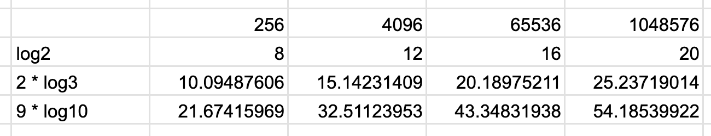

## Ülesanne 1: Lineaarotsing (Linear Search)

```sh
zig test ./src/solutions_3/1_linear_search.zig
```

> 3. Arutlege lühidal, kuidas Linear Search algoritmi saab kasutada reaalmaailma rakendustes ja millised on selle piirangud.

Lineaar otsing on kõige lihtsam. Tasub kasutada väikeste andemahtude puhul, kuna keerukamate algorütmide rakendamine ei tasu ära. Kui koguaeg on vaja midagi leida ja andmemaht on suur siis lineaarotsing ei esine hästi.

## Ülesanne 2: Kahendotsingu (Binary Search) rakendamine ja analüüs

```sh
zig test ./src/solutions_3/2_binary_search.zig
```

> 2. Võrrelge teoreetilises analüüsis valminud Binary Search'i ja Linear Search'i aegkomplekssust.

Lineaarotsingu halvim juhtum on `O(n)`, kuna kõik elemendid tuleb läbi käia. Parim juhtum on `O(1)`, kuna element võib olla esimene. Keskmine juhtum on `O(n/2)`, kuna element võib olla keskel.

Binaarotsingu ajaline keerukus on `O(log n)`, kuna iga sammuga väheneb otsitavate elementide hulk poole võrra.

> 3. Tooge näide stsenaariumist, kus Binary Search on kasulikum kui Linear Search, ja selgitage miks.

Binaarotsingu puhul peab olema massiiv sorteeritud, mis pärsib jõudlust. Binaarotsing esineb hästi suurte andmemahtude puhul, kuna otsitavate elementide hulk väheneb kiiresti.

## Ülesanne 3: Jump Search

> 1. Kirjutage lühike ülevaade Jump Search algoritmist, sealhulgas selle põhiprintsiibid ja pseudo-koodi näide.

Jump search on sarnane binaarotsinguga, kuid otsitakse mitte keskelt vaid hüpates algusest samm sammu haaval lõpuni. Hüppe pikkus on `sqrt(n)`. Kui hüppega saadud element on väiksem kui otsitav element, siis hüpatakse uuesti. Kui hüppega saadud element on suurem kui otsitav element, siis tehakse lineaarotsing eelneva ja selle hüppe indeksite vahel.

```sh
zig test ./src/solutions_3/3_jump_search.zig
```

> 2. Võrrelge Jump Search'i ajalist kompleksust Linear Searchi ja Binary Searchiga.

Kui hüppesuurus on `sqrt(n)` siis halvim juhtum on `O(sqrt(n) + sqrt(n))` ehk `O(sqrt(n))`.

> 3. Arutlege lühidalt stsenaariumide üle, kus Jump Search võib olla efektiivsem võrreldes Linear Searchi ja Binary Searchiga.

Jump searchi implementatsioon on lihtsam kui binaarotsingu oma. Kui otsida kõige väiksemat elementi või lähedal väiksemale toimib jump search paremini, kuna jump search hakkab algusest siis on vaja ainult ühte hüpet. Seevastu binary search peab väiksema leidmiseks tegema iga korda log(n) hüppet.

### Ülesanne 4: Kolmikotsing ja Kahendotsing (Ternary Search vs Binary Search)

> 1. Kirjutage lühike ülevaade Ternary Search algoritmist, sealhulgas selle põhiprintsiibid ja pseudo-koodi näide.

Ternary search on sarnane binaarotsingule, kuid otsitakse mitte keskelt vaid kolmandikust. Sarnaselt binaarotsingule hoitakse mälus vasakut ja paremat indeksit, kust vahelt otsitakse.

- Vasaku ja parema indeksi vahe jaotatakse kolmandikuks [vasak; mid1] U (mid1 -> mid2) U [mid2 -> parem].
- Kui otsitav väärtus on mid1 või mid2 on väärtus leitu
- Kui otsitav väärtus on väiksem kui mid1, siis otsitakse vasakust poolest ning `parem = mid1 - 1`.
- Kui otsitav väärutus on suurem kui mid2, siis otsitakse paremast poolest ning `vasak = mid2 + 1`
- Kui otsitav väärtus on mid1 ja mid2 vahel, siis otsitakse keskmisest kolmandikust, kus `vasak = mid1 + 1` ja `parem = mid2 -1`

```js
while (left <= right) do
  third = (right - left) / 3
  mid1 = left + third
  mid2 = right - third
  if (arr[mid1] == x) return mid1
  if (arr[mid2] == x) return mid2
  if (x < arr[mid1]) right = mid1 - 1
  else if (x > arr[mid2]) left = mid2 + 1
  else left = mid1 + 1, right = mid2 - 1
```

> 2. Võrrelge Ternary Search'i ja Binary Search'i aegkomplekssust. (Kas mõõdetud tulemus, teoreetiline võrdlus, vms)

Binaarotsingu puhul on komplektsus `O(log2(n))`, kuna iga sammuga väheneb otsitavate elementide hulk 2 korda.

Ternary searchi puhul on komplektsus `O(log3(N))`, kuna iga sammuga väheneb otsitavate elementide hulk 3 korda, `N = 3^n`.

Miks siis mitte tehan Decimal Search, kus komplektsus on `O(log10(n))` ja iga samm vähendab otsitavate elementide hulka 10 korda? Sellise puu nimetus on vist B+ tree, kus puu lehtede suuruse võib ise määrata nii, et sügavus jääks alati samaks.

Iga lisa astme (log2, log3, ..., logx) puhul on vaja teha rohkem võrdlusi loopi sees. Nt ternary search puhul peame võrdlema `otsitav = mid1 või otsitav = mid2`, aga binary search puhul peame võrdlema ainult `otsitave = mid`. Seega on Nary Search keerukus `O((N - 1) * logN(n))` ehk Ternary Search puhul `O(2 * log3(n))` ja Decimal Search puhul `O(9 * log10(n))`.



> 3. Arutlege lühidalt, kas Binary Search on üldiselt tõhusam kui Ternary Search ning millistes olukordades.

Binaar otsing on alati tõhusam, kuid teda ei saa kasutada funktsiooni min ja max väärtuste leidmisteks. Ternary search saab eksploiteerida min/max väärtuste leidmiseks parabool (nt `x^2 + x + 2 = 0`) fn-l mille tulem on bitooniline jada (nt `1, 2, 3, 2, 1` või `3, 2, 1, 2, 3`). Antud juhul ternary seach saab vaadelda kolmikuid (1, 2), (3), (2, 1) ning tuvastada, kas funktsioon antud piirkondades kasvab/kahaneb.

### Ülesanne 5: Otsingualgoritmide praktiline rakendamine

#### Jagatud laost toote asukohta otsimine

```
Otsitava toode:
  rohekas-4-veidike-69

Kõik poe tooted: TooteID = number
  { id: TooteID, sku: string }[]

Asukohad
  { id: AsukohaID, mahutavus: Mahutavus }[]

TooteAsukohadJärjekorras:
  [TooteId, AsukohaId], Järjestatud TooteId järgi suurenevalt
```

1. Lineaar otsing toodetele, kus sku = "rohekas-4-veidike-69", et leida TooteID
2. Binaar otsing TooteAsukohad nii, et iga binaar ulatuse sees kasutame keskmisel indeksi olevate toodetele lineaarotsingut, et leida TooteID

```
toote_sku = 'rohekas-4-veidike-69'
poe_tooted = [
  ...,
  { toote_id: 5, sku: 'rohekas-4-veidike-69" },
  ...
]
asukohad = [
  ...,
  { asukoha_id: 4, mahutavus: X },
  ...
]
toote_asukohad_järjekorras = [
  ...,
  [ aukoha_id = 999, toote_id = 4 ],
  [ aukoha_id = 4, toote_id = 5 ],
  [ aukoha_id = 10, toote_id = 6 ],
  ...
]

toode = lineaar_otsing(poe_tooted, toode.sku == 'rohekas-420-veidike-69')
asukoha_id = binaar_otsing(toote_asukohad_järjekorras, toode.id)
```

> Pärast ühe nende stsenaariumite või mõne muu sarnase reaalmaailma probleemi valimist kirjeldage, milline otsingualgoritm oleks kõige tõhusam ja miks. Arutage ka potentsiaalseid modifikatsioone, mis võiksid algoritmi teie valitud rakenduse jaoks optimeerida. Pidage meeles, et tuleb arvestada andmete omadusi, nagu suurus, struktuur ja uuendamise sagedus.

Eeldades, et erinevate poodide tooteid on ladudes palju võiks olla ränikaart, mis on ränistatud poe ID järgi.
Asukohti peab olema vähemalt sama palju, kui tooteid. Et hõlbsalt leida toote asukohti võiks olla igale toote küljes ka asukoha ID.

Kuid kui on vaja teada, mis tooted asuvad millises asukohas siis peaks kõik tooted läbi käima või duplitseerima toote viited asukohtadele massiivina toote ID-st. Et duplitseerimist vältida võiks olla üks koht kus siduda tooteid ja asukohti - masiiv `[asukoht, toode][]`. Et eel mainitud massivist leida effektiivselt toote asukohta peaksime looma samast masiivist koopia, mis on sorteeritud toote id järgi, et oleks võimalik kasutada binaar otsingut toote id järgi. Et leida kõiki tooteid, mis on asukohal, võiksime hoida koopiat `[asukoht, toode][]` masiivist mis on sorteeritud asukoha järgi, et kasutada veidi modifitseeritud binaar otsingut, et leida ühe asukoha indeks ning selle ümbruses kasutada lineaar otsingut, et leida kõik asukoha tooted.
